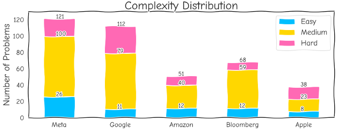

# LeetCode: Interview question statistics & how to run your own analytical report in 2022

**[Article on Medium](https://medium.com/@apetsiuk/leetcode-interview-question-statistics-how-to-run-your-own-analytical-report-in-2022-1b202ae48902)**


Comparative statistical analysis of top interview problems by topics, complexity, and popularity based on [pgmreddy’s list](https://leetcode.com/discuss/interview-question/1376426/facebook-interview-questions-july-2020-july-2021). This overview may help you choose the optimal preparation strategy and automatically analyze any other tasks, depending on the need.

The complete list of interview questions that I included in the statistics:
* Facebook (Meta) July 2020 — July 2021
* Google Jan — Jun 2020, Jul — Oct 2020
* Amazon July 2020 — July 2021
* Bloomberg July 2020 — July 2021
* Apple, Uber, Flipkart, Swiggy July 2020 — July 2021*

> *Given the small number of tasks for Apple, Uber, Flipkart, and Swiggy, they were all combined into a common database and are referred to as Apple in the text. It should also be noted that premium problems were not included in the statistics.




Each task on leetcode can belong to several topics at once. The tasks in all interview sets have a total of 43 possible topics. If we collect all the problems for each individual set and count the number of mentions of each topic separately, the distribution by topic for each company will look like this:


## An Intersection Set of 84 Interview Questions in Meta, Google, Amazon, Bloomberg, Apple, Uber, Flipkart, and Swiggy in 2021

Asterisk (*) and bold font indicate that the question is also on the Blind 75 list
```
ARRAY
*1:   Two Sum
*238: Product of Array Except Self
*153: Find Minimum in Rotated Sorted Array
31:   Next Permutation
34:   Find First and Last Position of Element in Sorted Array
41:   First Missing Positive
42:   Trapping Rain Water
84:   Largest Rectangle in Histogram
88:   Merge Sorted Array
283:  Move Zeroes
349:  Intersection of Two Arrays
380:  Insert Delete GetRandom O(1)
399:  Evaluate Division
452:  Minimum Number of Arrows to Burst Balloons
529:  Minesweeper
560:  Subarray Sum Equals K
973:  K Closest Points to Origin
977:  Squares of a Sorted Array
994:  Rotting Oranges
1010: Pairs of Songs With Total Durations Divisible by 60
1095: Find in Mountain Array
1169: Invalid Transactions
1235: Maximum Profit in Job Scheduling
1293: Shortest Path in a Grid with Obstacles Elimination

BINARY
29:   Divide Two Integers
67:   Add Binary

DYNAMIC PROGRAMMING
*322: Coin Change
*91:  Decode Ways
63:   Unique Paths II
72:   Edit Distance
139:  Word Break
140:  Word Break II
329:  Longest Increasing Path in a Matrix
688:  Knight Probability in Chessboard
1125: Smallest Sufficient Team
1335: Minimum Difficulty of a Job Schedule

GRAPH
*133: Clone Graph
*200: Number of Islands
210:  Course Schedule II
128:  Longest Consecutive Sequence

INTERVAL
*56:  Merge Intervals

LINKED LIST
*21:  Merge Two Sorted Lists
*23:  Merge k Sorted Lists
2:    Add Two Numbers
138:  Copy List with Random Pointer
146:  LRU Cache
203:  Remove Linked List Elements
445:  Add Two Numbers II

STRING
*3:   Longest Substring Without Repeating Characters
*76:  Minimum Window Substring
*242: Valid Anagram
*20:  Valid Parentheses
680:  Valid Palindrome II
127:  Word Ladder
155:  Min Stack
227:  Basic Calculator II
389:  Find the Difference
394:  Decode String
415:  Add Strings
692:  Top K Frequent Words
778:  Reorganize String
833:  Find And Replace in String
953:  Verifying an Alien Dictionary
1047: Remove All Adjacent Duplicates In String
1209: Remove All Adjacent Duplicates in String II
1249: Minimum Remove to Make Valid Parentheses
1396: Design Underground System

TREE
*124: Binary Tree Maximum Path Sum
*102: Binary Tree Level Order Traversal
*297: Serialize and Deserialize Binary Tree
*98:  Validate Binary Search Tree
*236: Lowest Common Ancestor of a Binary Tree
116:  Populating Next Right Pointers in Each Node
278:  First Bad Version
528:  Random Pick with Weight
547:  Number of Provinces
721:  Accounts Merge
987:  Vertical Order Traversal of a Binary Tree
1376: Time Needed to Inform All Employees

HEAP
*295: Find Median from Data Stream
239:  Sliding Window Maximum
621:  Task Scheduler
658:  Find K Closest Elements
```

In addition, a number of popular programming patterns for an efficient approach to problem-solving:

* [14 Patterns to Ace Any Coding Interview Question](https://hackernoon.com/14-patterns-to-ace-any-coding-interview-question-c5bb3357f6ed)
* [5 to 23 Patterns to Ace Any Coding Interview](https://hackernoon.com/5-to-23-patterns-to-ace-any-coding-interview)
* [LeetCode Patterns by csgator](https://medium.com/leetcode-patterns)
* [Official LeetCode Explore Cards](https://leetcode.com/explore/)
* [Best practice questions by the author of Blind 75](https://www.techinterviewhandbook.org/best-practice-questions)


